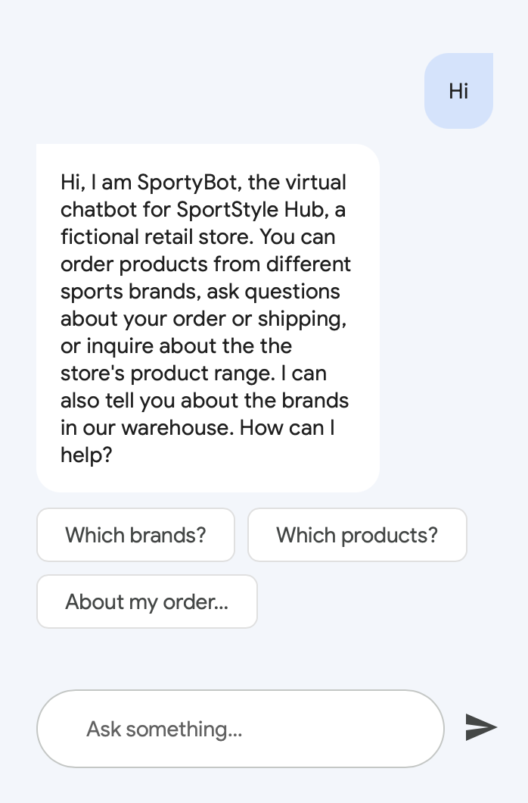
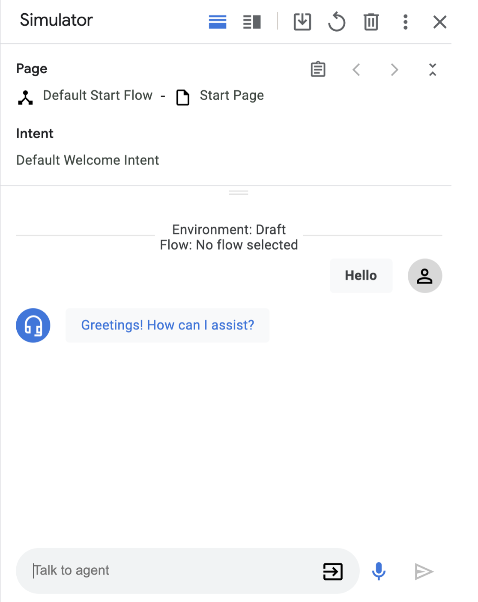
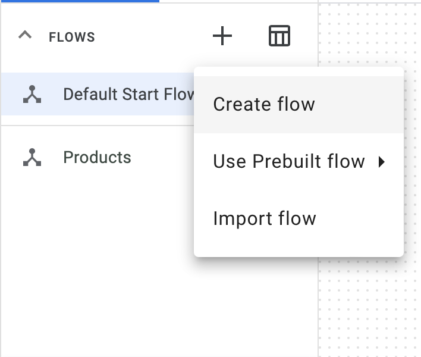

summary: Build a chatbot application for a retail startup using DialogFlow CX
id: docs
categories: Meta
tags: beginner
status: Published 
authors: Tahreem Rasul

# Build a chatbot application for a retail startup using DialogFlow CX

<!-- ------------------------ -->
## Overview 
Duration: 10

### Introduction
In this codelab, you will be introduced to the process of creating a sophisticated retail chatbot using [Dialogflow CX](https://cloud.google.com/dialogflow?utm_source=codelabs&utm_medium=et&utm_campaign=CDR_lee_aiml_leedialogflowlabs_cx_&utm_content=-&authuser=2&hl=en), 
a state-of-the-art Conversational AI Platform (CAIP). With Dialogflow CX, you can build and deploy versatile virtual 
agents such as chatbots, voice bots, and phone gateways. These agents can be integrated across a variety of channels 
and are capable of understanding and responding in over 50 different languages. 

What's especially exciting is that this is a no-code tool. Anyone, without any prior coding knowledge can utilize this platform
to build applications for their use cases. This is why the tool is so powerful, especially for startups to validate their ideas,
get feedback from their end users, and build PoCs. 

In this codelab, you'll learn to develop "SportyBot," a website chatbot for "SportStyle Hub," a fictional retail store 
specializing in sporting apparel and accessories from Nike, Adidas, and Puma. SportyBot will guide customers through 
the store's product range, providing details on the latest collections, exclusive items, personalized recommendations, 
and assisting with order placement and management.



#### Here's what you'll learn
- How to create a Dialogflow CX virtual agent within Google Cloud
- Learn about flows
- Learn about entities
- Learn about intents
- Learn about pages and transition pages with state handlers
- Learn how to transition pages with intent routes
- Learn how to transition pages with parameters & condition routes
- Learn how to return conditional responses with system functions
- Learn how to create fallback messages
- Learn how to use the simulator
- Learn how to create test cases & test coverage

### Here's what you need 
- Google Account
- Access to Google Cloud

<!-- ------------------------ -->
## Environment Setup
Duration: 10

### Create a Google Cloud project
Since Dialogflow CX runs in Google Cloud, you must create a Google Cloud project. A project organizes all your Google 
Cloud resources. It consists of a set of collaborators, enabled APIs (and other resources), monitoring tools, 
billing information, and authentication and access controls.

When you create a new project, you will need to enter a Project Name. And you will have to link it to an existing 
Billing Account and Organization.

A billing account is used to define who pays for a given set of resources, and it can be linked to one or 
more projects. Project usage is charged to the linked billing account. In most cases, you configure billing 
when you create a project. For more information, see the Billing documentation. Make sure that billing is enabled for your Cloud project.

### Enable the Dialogflow API
In order to make use of Dialogflow, you will have to enable the Dialogflow API for your project.

1. [Enable the Dialogflow API](https://console.cloud.google.com/apis/enableflow?apiid=dialogflow.googleapis.com&utm_source=codelabs&utm_medium=et&utm_campaign=CDR_lee_aiml_leedialogflowlabs_cx_&utm_content=-&authuser=2&project=sportybot)
2. Select the project you want to enable the API for, and click **Continue.**
3. Collapse the menu of APIs & Services and click on **Create Credentials**
4. **Click Application Data**
5. Say `No, I am not using them as you are not using Kubernetes Engine, App Engine or Cloud Functions` for now.
6. Click **Done**
Setup Credentials

### Create a new Dialogflow CX agent
To create a new Dialogflow CX agent, first open the Dialogflow CX Console:

[Dialogflow CX Console](https://dialogflow.cloud.google.com/cx/projects?utm_source=codelabs&utm_medium=et&utm_campaign=CDR_lee_aiml_leedialogflowlabs_cx_&utm_content=-&authuser=2)

1. Choose the previously created Google Cloud project.
2. Click Create agent.
3. Complete the form for basic agent settings:
- You can choose any display name.
- As location choose: us-central1
- Select your preferred time zone.
- Select en - English as default language
4. Click **Create.**

> aside positive
**Note:** In Dialogflow CX you can create multiple agents per project. When you set up an agent in 
> Dialogflow CX, you will have to tie it to a location explicitly.


<!-- ------------------------ -->
## Flows 
Duration: 10

Human conversations often diverge into various directions, typically encompassing multiple topics. In the case of 
the chatbot we are building for SportStyle Hub, we would have dialogs about the product catalog, payment, order status, 
and customer care questions. We could split these conversation topics into flows.


[Flows](https://cloud.google.com/dialogflow/cx/docs/concept/flow?utm_source=codelabs&utm_medium=et&utm_campaign=CDR_lee_aiml_leedialogflowlabs_cx_&utm_content=-&authuser=2) can 
be thought of as any path the conversation can take. It often makes sense to make these modular, and reusable. The idea is that different teams
should be able to work on individual flows. 

### Simulator
Before we begin, let's test our virtual agent at this stage. On the right side of Dialogflow CX Console you can test 
the virtual agent, with the built-in simulator. 

1. Click on the **Test Agent** button, in the top right of your screen.
2. In the talk to agent field write: `Hello` The virtual agent will respond with a default welcome text: 'Greetings! How can I assist?`

This can be configured to display a relevant welcome message.



### Default Start Flow
Every agent has one flow called the Default Start Flow. This single flow may be all you need for a simple agent. 
More complicated agents may require additional flows. The Default Start Flow is created automatically when you create an
agent. We can configure the Default Start Flow displays a relevant welcome message:
1. In the left *Build > Flows* sidebar, click on **Default Start Flow**, and select the **Start** tree node.

When you do this, you will notice that this automatically selects the **Start** page, in the *Build > Pages* sidebar section. 
We will touch upon Pages in a later section.

2. In *Start > Routes* click on the **Default Welcome Intent**.
An intent categorizes an end user's intention for a particular prompt. For example, on a first interaction with the bot, 
the user would expect to be guided on the usage of the chatbot. 

3. Remove all the **Agent says** entries, and add this new text:

`Hi, I am SportyBot, the virtual chatbot for SportStyle Hub, a fictional retail store. You can order products from 
different sports brands, ask questions about your order or shipping, or inquire about the the store's product range. 
I can also tell you about the brands in our warehouse. How can I help?`

To streamline the conversation, we will also need some quick reply buttons / suggestion chips.

4. Click on **Add dialogue option > Custom payload** and use the below code snippet.
5. Use the below code snippet as a Custom payload, and hit Save.

```json
{
    "richContent": [
      [
        {
          "type": "chips",
          "options": [
            {
              "text": "Which brands?"
            },
            {
              "text": "Which products?"
            },
            {
              "text": "About my order..."
            }
          ]
        }
      ]
    ]
  }
```


### Creating Flows
1. In Dialogflow CX, click on the + icon > **Create flow**.
2. Specify the name: *Products* and hit enter.



Similarly, go ahead and create flows for the following as well:
- `Order Process`
- `My Order`
- `Customer Assistance`

Once done, it should look something like this:


### Testing in DialogFlow Messenger
Dialogflow Messenger brings a rich Ul for Dialogflow that enables developers to easily add conversational agents to
websites. To be able to see rich content such as suggestion chips, this tool can be utilized. 

1. In the left sidebar, click on *Manage > Integrations*.
2. Choose **Dialogflow Messenger** and click on **Connect**.
3. In the popup click **Enable**.


Once done, you should be able to view the suggestion chips we have integrated so far.


<!-- ------------------------ -->
## Entities
[Entity types](https://cloud.google.com/dialogflow/cx/docs/concept/entity?utm_source=codelabs&utm_medium=et&utm_campaign=CDR_lee_aiml_leedialogflowlabs_cx_&utm_content=-&authuser=2) are 
used to control how data from end-user input is extracted. Entities in databases and technology are foundational elements 
that represent real-world objects or concepts with distinct characteristics.

### Creating Entities
Let's create a *Brand* entity:
1. Click *Manage > Entity* Types
2. Click + **Create**
- Display Name: **Brand**
- Entities:
- Nike (with synonym: nike)
- Adidas (with synonym: adidas)
- Puma (with synonym: Puma)
3. In **Advanced options**:
- check **Fuzzy Matching**. (If you spell the band name wrong, it might still match it to the right entity.)
- also check **Redact in log**. (If you spell the band name wrong, it will correct the name in the log.)
3. Click **Save**


Similarly, we will create an entity of type *Product*:
1. Click *Manage > Entity* Types
2. Click + **Create**
- Display Name: **Product**
- Entities:
- T-shirt (with synonym: tshirt, sports-wear, sports-shirt)
- Sneakers (with synonym: sneakers, joggers, tennis shoes)
3. Click **Save**

We will also need an entity for clothing and shoes sizes. In a real world scenario, these will be separate, but for 
simplicity, we will merge this into a single entity:
1. Click *Manage > Entity* Types
2. Click + **Create**
- Display Name: **Size**
- Entities:
- XS (with synonym: Extra Small, 8)
- S (with synonym: Small, 10)
- M (with synonym: Medium, 12)
- L (with synonym: Large, 14)
- XL (with synonym: Extra Large, 16)
3. Click **Save**

Finally, we will have an entity for *Order Number*. This will be alphanumeric, of the following format (ABCD123)
1. Click *Manage > Entity* Types
2. Click + **Create**
- Display Name: **OrderNumber**
- Regexp entities
- Entity: [A-Z]{4}[0-9]{3}
3. Click **Save**

<!-- ------------------------ -->
## Intents
An [intent](https://cloud.google.com/dialogflow/cx/docs/concept/intent?utm_source=codelabs&utm_medium=et&utm_campaign=CDR_lee_aiml_leedialogflowlabs_cx_&utm_content=-&authuser=2) categorizes an 
end-user's intention for one conversation turn. When an end-user writes or says something, referred to as end-user 
input, Dialogflow compares the input to intent training phrases to find the best match. This process is called *intent matching*. 
Intent matching can only occur for intents associated with an *intent route* (a state handler with an intent requirement) in scope.

### Creating Intents
Let's start by preparing all the intents before we can design the pages in a flow.

1. Click the *Manage > Intents*.
2. Click on + **Create**

Use the following details:
- Display name `redirect.brands.overview`
- Description `Brands overview: The brands available at the store`

> aside positive
> **Note**: As a best practice, we will use the following naming convention for pages & intents: all characters are lowercase, 
> use dots (.) instead of spaces. Intents use the following prefixes: **redirect** for intents that use NLU to fetch a page, 
> **confirm/decline** for intents that confirm or decline choices (‘yes' or ‘no' training phrases) 
> and **supp** in case it's a supplemental question, which can come back at any moment in the flow.


Scroll down and create the following **training phrases**:

- `Which brands are signed?`
- `Which brands` 
- `Which brands are part of the store`
- `Who is part of the store`
- `From which brands can I buy stuff `
- `Sports brands`
- `Which brands do you have?`
- `Which brands are supported by the label`
- `From who can I buy shirts`
- `What brands can I order`
- `Can I get an overview of all the brands`

3. Click **Save**.

You  can go ahead and add intents for the rest of the conversation flows.

| Display Name               | Training Phrases                                                                                                                                                                                                                |
|----------------------------|:--------------------------------------------------------------------------------------------------------------------------------------------------------------------------------------------------------------------------------|
| redirect.product.overview  | "Which products do you sell?", "What items do you have?", "What are you selling?", "What are the items?", "Which products?", "Please tell me what you have"                                                                     |
| confirm.brands.overview    | "Yeah, let me buy something", "Yes, I want to purchase something", "Yes, I would like to order stuff from Nike", "Ok, let's buy stuff."                                                                                         |
| redirect.price             | "How much does a t-shirt cost?", "What's the price for the sneakers?", "I want to know the price of a sports shirt", "What's the price difference?", "What does each product cost?", "What does it cost?", "What is the price?" |
| redirect.shirt.size        | "XS", "I have M", "I want Large", "My size is 3XL", "Extra Large is the size"                                                                                                                                                   |
| redirect.my.order          | "About my order", "I have a question about my order", "My order is ABCD123, I have a question about my order."                                                                                                                  |
| redirect.my.order.canceled | "I want to cancel my order", "I want to cancel order ABCD123", "Please cancel order ABCD123", "Undo my order", "Stop my order", "Cancel"                                                                                        |
| confirm.proceed.order      | "Yes", "Yes, please continue", "Yes order", "I want to order", "Yeah", "Yep", "I confirm", "Agree", "Go ahead", "Order", "Buy it", "Purchase", "Okay"                                                                           |
| decline.proceed.order      | "No", "I rather not", "I don't want it anymore", "Don't order", "Stop", "Not anymore", "Nope", "Go back", "Reset", "Decline", "I don't need it"                                                                                 |
| redirect.home              | "Go back", "Home", "Help", "What else can I ask", "Restart", "Can you tell me what I can order?", "What questions can I ask", "I need help", "Advice please", "Hi", "Hello", "Good day!"                                        |
| redirect.end               | "No that's it, goodbye", "Bye", "Cheers", "End", "That's it", "No more questions", "Exit", "Have a good day", "End Call", "Close"                                                                                               |
| redirect.shipping.info     | "How long will it take?", "How long is shipping?", "How long does shipping take?", "When will I receive it?"                                                                                                                    |

<!-- ------------------------ -->
## Page and State Handlers

ChatGPT
ChatGPT
A Dialogflow CX conversation, or session, resembles a finite state machine, akin to a vending machine. In this model, 
different states such as 'Waiting for Coins' and 'Select Candy' represent the stages of interaction. In Dialogflow CX, 
these states are modeled as "pages." A conversation progresses through these pages, with only one page active at any 
given time, including its associated flow.

Within each Flow, numerous pages collectively manage a full conversation on the designed topic(s). Each flow begins 
at a special start page, transitioning between pages based on user interactions. Pages comprise fulfillments 
(like static entry dialogues or webhooks), parameters, and state handlers for conversation control. 

These transitions occur through three route types:

**Intent Routes:** Trigger page changes based on user's spoken input.
**Condition Routes:** Initiate changes based on session parameters.
**Event Handlers:** Address fallback events like no input or match.

*Fulfillment*, defining the conversation's content or response, can be static or dynamic:

**Static Fulfillment:** Provides a fixed response.
**Dynamic Fulfillment:** Calls a webhook for tailored responses.
For our retail bot, we'll design intent routes with static entry fulfillments and use condition routes 
with parameters to facilitate merchandise orders.

### Page Intent Routes
#### Creating the pages in the Default Start Flow
1. Click *Build > Default Start Flow*
2. Click the **Start** Page
3. Click the + icon next to **Routes**
4. Add `redirect.product.overview`
5. Scroll down to **Transition**, and transition to the `Product` flow.
6. Hit **Save**
7. Repeat the above steps for redirect.brands.overview and the other rows from this table:

| Page (In Flow) | Routes > Intent            | Routes > Transition To    |
|----------------|----------------------------|---------------------------|
| Start          | Default Welcome Intent     | -                         |
| Start          | redirect.product.overview  | Flow: Product             |
| Start          | redirect.brands.overview   | Flow: Product             |
| Start          | redirect.my.order          | Flow: My Order            |
| Start          | redirect.my.order.canceled | Flow: My Order            |
| Start          | redirect.my.order.status   | Flow: My Order            |
| Start          | redirect.shipping          | Flow: Customer Assistance |
| Start          | redirect.end               | Page: End Session         |


Once all the above routes have been added to the start flow, it starts to look like our original drawing:


#### Creating the pages in the Products Flow
Let's first start with connecting the pages.

1. Click *Build > Product*
2. Click the **Start** Page
3. Click the + icon next to **Routes**
4. Add `redirect.brands.overview`
5. Scroll down to **Transition**, select **Page** and choose: + new **Page**
6. Use the page name: Brands Overview and hit **Save**
7. Now let's finish the rest of the flow:

Similar to before, the routes can be built within each flow. Towards the end, the workflow should look something like
this:


